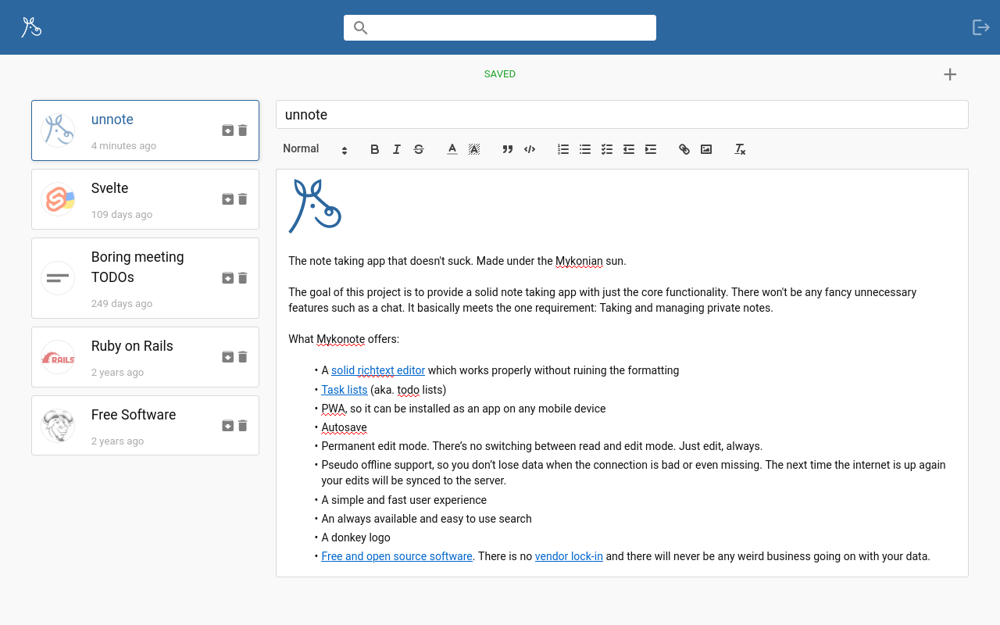
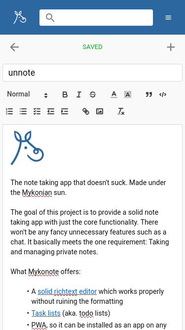
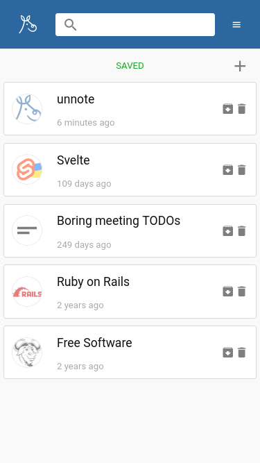

[](https://travis-ci.org/panter/mykonote)
[](https://codeclimate.com/github/panter/mykonote)

# Mykonote [/ˈmɪkəˌnəʊt/]

*You can register for a free account at
[mykonote.com](https://app.mykonote.com/#/register) or within the Android
[mobile app](https://github.com/panter/mykonote-app), which is available on
[Google Play](https://play.google.com/store/apps/details?id=com.mykonote).*
<br>
*The free account is limited to 100 notes.*

<a
  href='https://play.google.com/store/apps/details?id=com.mykonote&pcampaignid=MKT-Other-global-all-co-prtnr-py-PartBadge-Mar2515-1'>
  
</a>

---






The note taking app that doesn't suck. Made under the Mykonian sun.

The goal of this project is to provide a solid note taking app with just the
core functionality. There won't be any fancy unnecessary features such as a
chat. It basically meets the one requirement: Taking and managing private
notes.

What Mykonote offers:

* A [solid richtext editor](http://quilljs.com/) which works properly without
  ruining the formatting
* [Task lists](https://github.com/koffeinfrei/quill-task-list) (aka. todo
  lists)
* Mobile support
* [A mobile app](https://github.com/panter/mykonote-app)
* Offline support, so you don't lose data when the connection is bad or even
  missing. The next time the internet is up again your edits will be synced to
  the server.
* A simple and fast user experience
* An always available and easy to use search
* A donkey logo
* [Free and open source software](https://www.gnu.org/philosophy/free-sw.html).
  There is no [vendor lock-in](https://en.wikipedia.org/wiki/Vendor_lock-in)
  and there will never be any weird business going on with your data.


## Development setup

To get the application started the standard rails setup routine can be
executed.

  ```bash
  $ bin/setup
  ```

You can now start the application and give it a try at
[localhost:3000](http://localhost:3000).
There's a demo user `user@example.com` with the password `asdfasdf`.

  ```bash
  $ rake start
  ```

### Testing

For the capybara e2e tests headless firefox / geckodriver is used.

- [Download latest firefox beta](https://www.mozilla.org/en-US/firefox/channel/desktop/)
- [Download latest geckodriver](https://github.com/mozilla/geckodriver/releases/latest)
- Put both binaries in your `$PATH`


## License

    Copyright 2016 Panter AG <info@panter.ch>

    This program is free software: you can redistribute it and/or modify
    it under the terms of the GNU Affero General Public License as
    published by the Free Software Foundation, either version 3 of the
    License, or (at your option) any later version.

    This program is distributed in the hope that it will be useful,
    but WITHOUT ANY WARRANTY; without even the implied warranty of
    MERCHANTABILITY or FITNESS FOR A PARTICULAR PURPOSE. See the
    GNU Affero General Public License for more details.

    You should have received a copy of the GNU Affero General Public License
    along with this program. If not, see <http://www.gnu.org/licenses/>.
